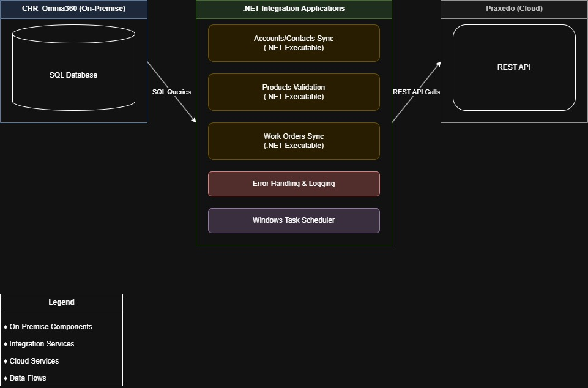
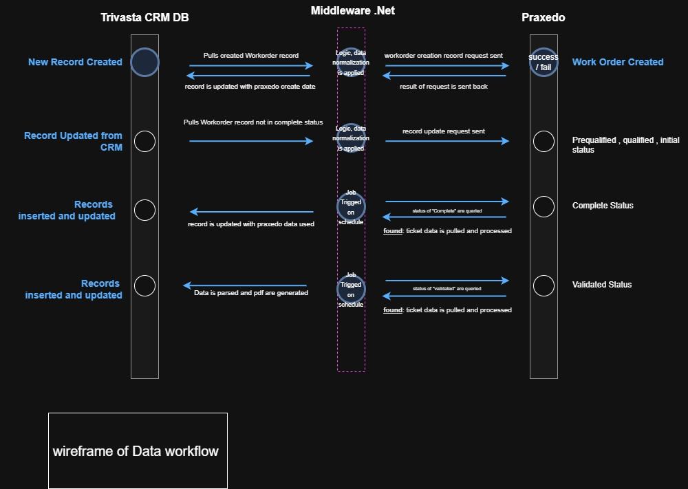

# TruVista & Praxedo Integration

## <ins>Overview</ins>
  This project provides basic data integration between **TruVista’s CHR_Omnia360 ERP/CRM** application and **Praxedo’s WorkOrder and Dispatch application**. The solution is an **OnPremise .NET Application** that extracts, transforms, and loads (ETL) data between the two systems, ensuring accurate synchronization.

### Solution Architecture
  
*This diagram outlines the major components of the system integration.*

### Wireframes (Draft)
  
*Preliminary wireframe sketch of the application UI workflow.*

###  <ins>User Stories</ins>
1. **System Administrator**  
   *As a system administrator, I want the integration to handle API authentication automatically using secure credentials so that I don’t have to configure it manually.*
2. **Operations Manager**  
   *As an operations manager, I need work orders from CHR to be automatically synced to Praxedo and vice versa so that my team can focus on field operations instead of data entry.*
3. **Data Analyst**  
   *As a data analyst, I want account and contact information to be consistently updated between CHR and Praxedo so that reporting and customer records remain accurate.*
4. **Field Technician**  
   *As a field technician, I need completed work orders in Praxedo to reflect updates in CHR in real time so that my job completion status is accurately recorded.*
5. **DevOps Engineer**  
   *As a DevOps engineer, I need comprehensive logging and error-handling for each data sync so that I can quickly diagnose and resolve any integration failures.*

##  <ins>Use Cases</ins>
[📄 View Detailed Use Cases](docs/use-cases.md)

## Use Case Diagram
  
*This diagram visualizes the actors and system interactions.*

## Requirements
- **Programming Language:** C# .NET
- **Database:** SQL Server
- **API Integration:** REST/SOAP (depending on Praxedo’s API)
- **Authentication:** Secure API token-based authentication
- **Logging & Error Handling:** Event logs, retry mechanisms

## Repository Contents
- `README.md` (This file)
- `docs/` (Design documents, including user stories, use cases, and architecture diagrams)
- `images/` (Diagrams for architecture, wireframes, and use case models)
- `src/` (Project source code)
- `logs/` (Error and execution logs)

---

## **Next Steps**
- [ ] Finalize wireframe sketches using **Draw.io** or **Pencil Project**.
- [ ] Create architecture and use-case diagrams.
- [ ] Populate repository with initial `.NET` project structure.
- [ ] Set up API credentials and data mapping in CHR and Praxedo.

---

We are off!🚀
